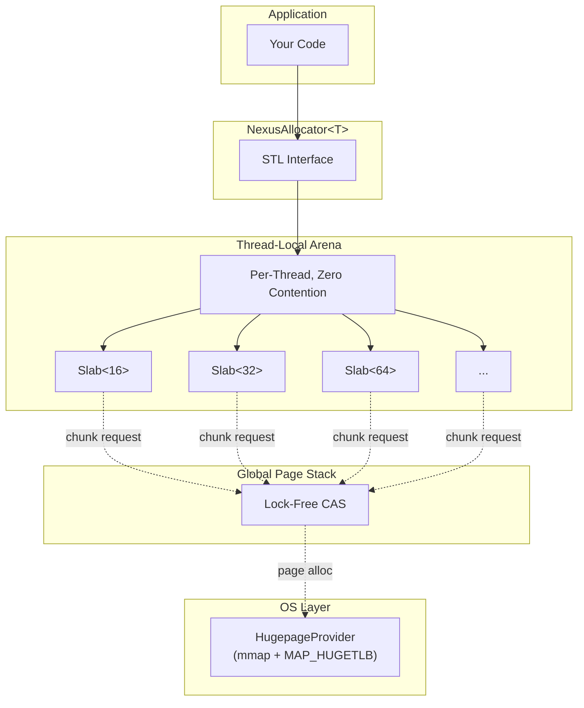

# NexusAlloc

A high-performance, lock-free C++20 memory allocator designed for latency-sensitive applications.

## Features

- **🔒 Lock-Free Design** - Uses atomic operations (CAS) instead of mutexes
- **🧵 Thread-Local Arenas** - Zero-contention fast-path allocations via `thread_local`
- **📄 Hugepage Support** - Reduces TLB misses and page fault jitter with 2MB pages
- **⚡ O(1) Allocation** - Slab-based segregated free lists for constant-time operations
- **🎯 SIMD-Friendly** - 16-byte minimum alignment for all allocations
- **📊 STL Compatible** - Drop-in replacement for `std::allocator`

## Quick Start

```cpp
#include <nexusalloc/nexusalloc.hpp>
#include <vector>

int main() {
    // Optional: Lock memory to prevent page faults
    nexusalloc::initialize();

    // Use with STL containers
    std::vector<int, nexusalloc::NexusAllocator<int>> vec;
    vec.push_back(42);

    // Or use directly
    void* ptr = nexusalloc::allocate(64);
    nexusalloc::deallocate(ptr, 64);
}
```

## Building

```bash
# Debug build (default)
make build

# Release build
make build BUILD_TYPE=Release

# Run tests
make test

# Run benchmarks
make bench
```

## Architecture



## Size Classes

| Range           | Increment   | Classes               |
| --------------- | ----------- | --------------------- |
| 1-256 bytes     | 16 bytes    | 16, 32, 48, ..., 256  |
| 257-65536 bytes | Power of 2  | 512, 1024, ..., 65536 |
| >65536 bytes    | Direct mmap | N/A                   |

## Enabling Hugepages

```bash
# Check current hugepage allocation
cat /proc/meminfo | grep Huge

# Reserve hugepages (requires root)
echo 100 | sudo tee /proc/sys/vm/nr_hugepages
```
